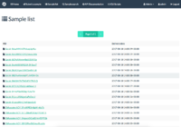

About MASS
----------
The Malware Analysis and Storage System (MASS) provides a distributed and scalable architecture to analyze malware samples. The MASS server contains a database of all submitted malware samples and all the gathered analysis data. Analysis systems are connected to the MASS server and automatically receive new samples in order to execute an analysis. Researchers can obtain the analysis results via the MASS web interface or the REST API.

The goal of our project is to create a flexible and reusable platform for malware analysis which empowers collaboration between malware researchers. MASS is free and open source software licensed under the terms of the MIT license. Other researchers are invited to contribute to the MASS development!

Join MASS
---------------------

University of Bonn and Fraunhofer FKIE are currently looking for motivated students to get in touch with this exciting project. As we believe that the analysis of malware can be improved by the cooperation between different institutions, development of our tools is focused on improving the free information exchange between research organisations. Our current work allows us to bring students in touch with malware research while developing a software platform for collaborative work on malware analysis.

Interested students are advised to [join our mailing list](https://lists.iai.uni-bonn.de/mailman/listinfo.cgi/mass-project) and should not hesitate to ask questions about MASS, potential features etc.!

### Project ideas

#### Advanced sample clustering

Identifying similar malware samples and finding groups/clusters of similar files is a very prominent task in malware analysis. While researchers in the past have proposed several methods to cluster malware samples based on specifically selected features, our initial work has shown that using MASS we can follow a generic and flexible approach to this problem - combining the excellent metrics provided by other researchers. In the next step we want to find out whether it is possible to gain additional information by comparing the sample clusters automatically generated with our algorithm and sets of malware samples which have been hand-picked by malware researchers.

*This is a very interesting project for students who are proficient in machine learning and big data topics. Previous knowledge about topics like similarity analysis, clustering algorithms etc. is strongly advised.*

#### Interactive shell

For many "power users" working with a command line interface is still the most productive way of using a computer to get work done. We believe that this does also hold true for many malware researchers. A very good example of how an interactive shell for a malware database might look like has already been implemented by the great [Viper](http://viper.li/) project. We like to implement a similar feature for MASS, which should rely on our powerful REST API for data exchange.

*Students interested in this topic should have good working knowledge of Python 3 and should be willing to work with suitable libraries for interactive command parsing, code completion etc.*

#### Interestingness scoring and gamification

When it comes to creating a really large database of malware samples, sooner or later you will have to decide: Which of the malware samples is most interesting to queue on which analysis system? Which sample should probably be analyzed again at some time? And which information provided by the analysis systems is the most interesting? During the GSoC we would like to brainstorm and implement a mechanism to decide about the relevance of certain pieces of information and to "score" these pieces accordingly. And of course, when it comes to scoring you may quickly think about ranking the best users and analysis tools :-)

*This topic requires at least some basic knowledge about machine learning and/or data mining. Students should be willing to explore the available literature (access/help will be provided), but are also encouraged to develop own ideas.*

#### Federation framework

Cooperation and open exchange of information are two of the main goals of MASS. However, we do not think that MASS should be "one big database", but rather each organization using MASS should maintain a database of the malware research data most relevant to their projects. However, this databases should be interoperable, i.e. multiple MASS systems should be interconnectable in order to easily access and exchange the available information. Thus we would be happy to find a student willing to design and implement a suitable federation mechanism.

*This topic includes in-depth work with our existing Python server code, especially the REST API. Good Python programming skills and at least basic knowledge about technologies such as JSON APIs, message queues etc. are advised.*

#### Malware meta crawler

One important part of building a comprehensive database of malicious software is to have a continuous stream of new malware samples. However, this is not an easy task since we not needingly know how and where the malware is distributed. Fortunately there are several projects which aim to track malware infections in different parts of the internet. They provide lists of e.g. domains or hyperlinks which are known to contain malware samples. We can then systematically search these sources for malicious files and post them to our database. There already exist software tools to accomodate this task, e.g. [Maltrieve](https://github.com/krmaxwell/maltrieve). However, we think that this process can be more tightly integrated into the MASS infrastructure, so that in the end we have a better understanding and traceability about malware distribution sources on the internet.

*Working on this topic means getting in touch with several open source software tools. A solid knowledge about installing, compiling and operating software on a Linux operating system is advised.*

#### Data visualization

When it comes to examining large data sets, proper visualization is a very important aspect. It can help a human to spot interesting features in the data and especially in the context of malware analysis to find malware samples which are worth considering for an in-depth analysis. With the data we have, we should be already able to create various useful types of visualization.

*Students are invited to brainstorm and bring in their own ideas for this topic. Previous knowledge of data visualization is recommended but not a necessary precondition.*

Screenshots
-----------

    
    
    
    
    
    
    
    

Developer team
--------------
The Malware Analysis and Storage System (MASS) is a joint research project by the [Communication and Network Systems Group @ University of Bonn](https://net.cs.uni-bonn.de/) and the [Cyber Analysis and Defense Group @ Fraunhofer FKIE](https://www.fkie.fraunhofer.de/de/ueber-fkie/forschungsabteilungen/ca-d---cyber-analysis-and-defense.html).

- - -

Contact us
----------

* For questions, support, development ideas, ..., please use our [Gitter chat room](https://gitter.im/mass-project/chat) (see below)

<iframe width="640" height="400" src="https://gitter.im/mass-project/chat/~embed" frameborder="0" allowfullscreen="allowfullscreen"></iframe>

Imprint
-------

    Universität Bonn - Institut für Informatik IV
    Fabian Rump
    Friedrich-Ebert-Allee 144
    53113 Bonn
    Germany
    rumpf@cs.uni-bonn.de
    
